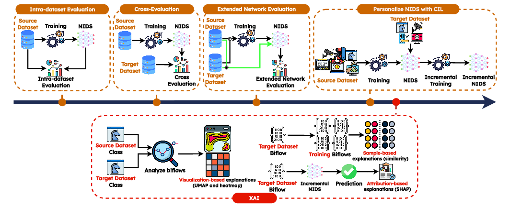

# Adaptable, Incremental, and Explainable Network Intrusion Detection Systems for Internet of Things
## Code and Data

This repo contains the code and the data leveraged in the work named **"Adaptable, Incremental, and Explainable Network Intrusion Detection Systems for Internet of Things"**, which has been submitted for revision to _Engineering Applications of Artificial Intelligence (EAAI)_, Elsevier.



## Code Description

`python3 main.py`

- `--exp-name` - the name of the experiment;
- `--results-path` - the path where results will be stored;
- `--datasets` - the couple of datasets to use, passed as `source target`; available datasets are: `edge_iot`, `iot_nidd`, and `ton_iot`;
- `--fields` - the packet fields to use as input; available fields are: `PL` (packet length), `IAT` (inter-arrival-time) `DIR` (packet direction), `WIN` (TCP window size);
- `--num-pkts` - the number of packets of biflows to take as input;
- `--batch-size` - the size of batches used for training the DL model;
- `--nepochs` - the maximum number of training epochs;
- `--save-models` - a flag that enable the saving of trained models;
- `--network` - the DL model to train;
- `--approach` - the learning approach for CIL and DIL; available approaches are: `scratch`, for training from scratch; `jointft`, for FT (Fine-Tuning) or FT-Mem (Fine-Tuning w/ Memory) when a memory is leveraged; `bic`, for BiC (Bias Correction);
- `--seed` - integer that sets the random seed used for train-test split and DL model initialization;
- `--num-exemplars` - the size of the leveraged memory; used with FT-Mem and BiC approaches.

## Examples of Usage

### Experiments Execution

Follow a list of commands that exemplifies the usage of the framework (launch them in the `./src/` folder).

#### Extendend Scenario

```bash
# Source network: IoT-NID; Target network: TON_IoT
# Approach: Scratch
python3 main.py --exp-name src_iot-nidd_dst_ton-iot --results-path ../results/ --datasets iot_nidd ton_iot --fields PL IAT DIR WIN --num-pkts 10 --batch-size 64 --nepochs 100 --save-models --network Lopez17CNN --approach scratch --seed 1
```

```bash
# Source network: IoT-NID; Target network: TON_IoT
# Approach: FT
python3 main.py --exp-name src_iot-nidd_dst_ton-iot --results-path ../results/ --datasets iot_nidd ton_iot --fields PL IAT DIR WIN --num-pkts 10 --batch-size 64 --nepochs 100 --save-models --network Lopez17CNN --approach jointft --seed 1
```

```bash
# Source network: IoT-NID; Target network: TON_IoT
# Approach: FT-Mem
python3 main.py --exp-name src_iot-nidd_dst_ton-iot --results-path ../results/ --datasets iot_nidd ton_iot --fields PL IAT DIR WIN --num-pkts 10 --batch-size 64 --nepochs 100 --save-models --network Lopez17CNN --approach jointft --seed 1 --num-exemplars 100
```

```bash
# Source network: IoT-NID; Target network: TON_IoT
# Approach: BiC
python3 main.py --exp-name src_iot-nidd_dst_ton-iot --results-path ../results/ --datasets iot_nidd ton_iot --fields PL IAT DIR WIN --num-pkts 10 --batch-size 64 --nepochs 100 --save-models --network Lopez17CNN --approach bic --seed 1 --num-exemplars 100
```

### Computing Metrics

The following commands compute the per-class metrics of each experiment (launch them in the `./src/` folder).

```bash
# Approach: Scratch
python3 compute_metrics.py --exp-name scratch --results-path ../results/ --yes
```

```bash
# Approach: FT
python3 compute_metrics.py --exp-name jointft --results-path ../results/ --yes
```

```bash
# Approach: FT-Mem
python3 compute_metrics.py --exp-name jointft-mem --results-path ../results/ --yes
```

```bash
# Approach: BiC
python3 compute_metrics.py --exp-name bic-mem --results-path ../results/ --yes
```

The excution of such commands generates the per-class metrics file in the `results` folder of each experiment. These files of metrics end with `_per_class_metrics.parquet`.

### XAI Pipeline

#### TBD
